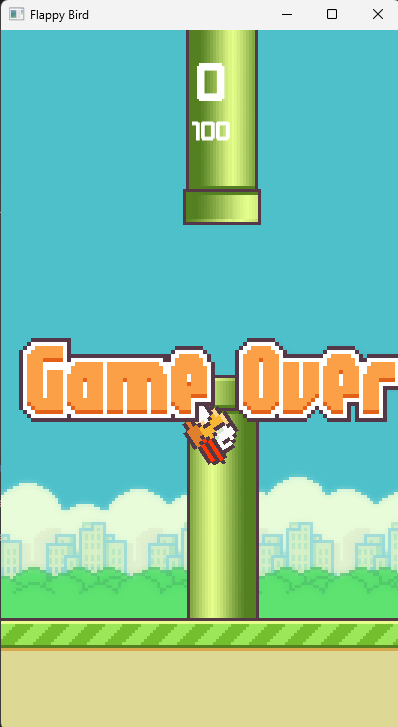

# Flappy Bird Game

Este proyecto es una implementación simple del juego Flappy Bird en C, utilizando la biblioteca SFML. El juego presenta un pájaro que el jugador puede hacer saltar para evitar obstáculos en forma de tuberías que se desplazan hacia la izquierda.

## Estructura del Proyecto

El proyecto está estructurado de la siguiente manera:

- **bin**: Contiene los archivos binarios generados después de compilar el código.
- **docs**: Almacena la documentación del proyecto.
- **include**: Contiene los archivos de encabezado (.hpp) para cada clase del proyecto.
- **src**: Contiene los archivos fuente (.cpp) del proyecto.
- **Makefile**: Archivo Makefile para compilar y ejecutar el proyecto.

## Diagrama de Clases

El diagrama de clases del proyecto incluye las siguientes clases:

- **Bird**: Representa al pájaro en el juego.
- **Tubo**: Representa las tuberías que el pájaro debe evitar.
- **Juego**: Controla la lógica del juego.

## Integrantes:

    Rodrigo Lagos Navarro 23110148
   

## Compilación y Ejecución

Para compilar el proyecto, ejecuta el siguiente comando en la terminal:

    make runmain

en caso de que no funcione ejecutar

    make clean 
    make runmain

# Capturas de pantalla 

